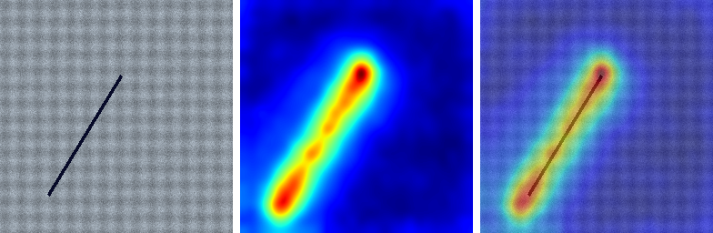
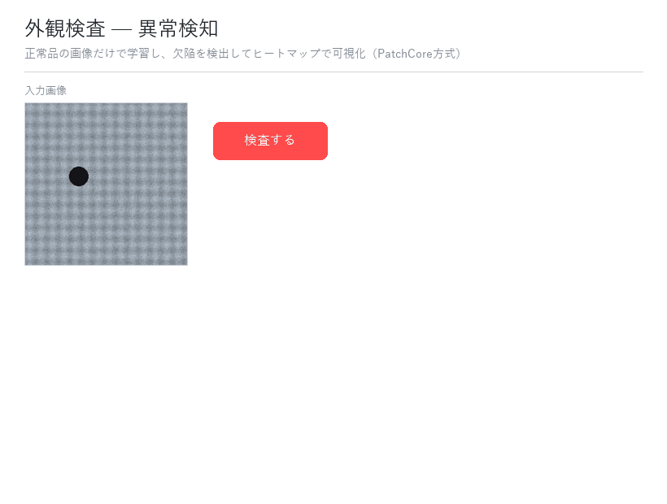
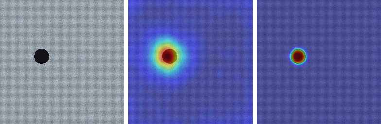
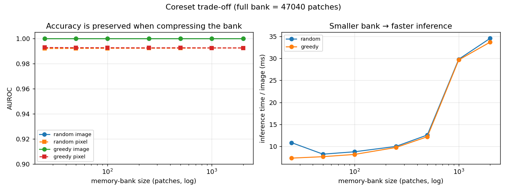

# 🔍 Visual Anomaly Detection — 外観検査（正常品だけで学ぶ異常検知）

[](https://github.com/Cherie01234/defect-detection/actions/workflows/ci.yml)

**正常品の画像だけ**で学習し、欠陥（傷・異物・欠け）を**検出**して**位置をヒートマップで可視化**する表面検査デモです。
学習済みCNNのパッチ特徴を使った **PatchCore方式**（勾配学習なし・CPUで動作）を自前実装し、**AUROCで精度を定量評価**しています。



*左: 入力（傷あり） ／ 中央: 異常ヒートマップ ／ 右: 重ね合わせ。正常品の画像だけからスクラッチ位置を特定。*

---

## 🎬 アプリのデモ



画像をアップロードして「検査する」を押すと、**異常スコア・判定（OK/NG）・異常マップ**（原画像／ヒートマップ／重ね合わせ）が表示されます。しきい値は正常画像から自動キャリブレーションします。

## ✨ 仕組みと工夫

| # | 要素 | 内容 |
|---|---|---|
| 1 | **メモリバンク方式** | ImageNet学習済みResNetの中間層特徴で正常パッチの「記憶」を作り、検査画像の各パッチを最近傍の正常パッチとの距離で採点（[`src/detector.py`](src/detector.py)） |
| 2 | **異常マップ** | パッチ距離をアップサンプリング＋ガウシアン平滑化し、ピクセル単位のヒートマップに（[`src/visualize.py`](src/visualize.py)） |
| 3 | **2つのAUROC評価** | 画像単位（欠陥/正常の分離）とピクセル単位（欠陥領域の特定精度）を計測（[`eval/run_eval.py`](eval/run_eval.py)） |
| 4 | **学習不要・CPU完結** | 勾配学習ループなし。60枚の正常画像から数秒で「学習」、50枚の検査が15秒以内 |

## 📊 精度（合成データセット）

| 指標 | スコア |
|---|---|
| Image-level AUROC | **1.000** |
| Pixel-level AUROC | **0.993** |
| 検査時間 | 50枚 / 約15秒（CPU） |

> 合成データは欠陥が明瞭なため高スコアになります。**実運用の難易度は MVTec AD で測るのが定番**です（下記「実データへの差し替え」）。
> 数値は `python eval/run_eval.py` で再現できます。

## 🏗️ パイプライン

```
正常画像 ──► FeatureExtractor (ResNet layer2+layer3)
                     │ パッチ特徴
                     ▼
              メモリバンク構築（coreset）        ← fit()
                     │
検査画像 ──► パッチ特徴 ──► 最近傍距離 ──► 異常マップ + 画像スコア   ← predict()
                                              │
                                       ヒートマップ重ね描き / AUROC評価
```

## 🚀 ローカル実行

```bash
# CPU版torchの場合（推奨）
pip install torch torchvision --index-url https://download.pytorch.org/whl/cpu
pip install -r requirements.txt

python data/make_synthetic.py     # 合成データ生成（オフライン）
python eval/run_eval.py           # AUROC計測
python eval/compare_methods.py    # PatchCore vs Autoencoder 比較
python eval/bench_coreset.py      # Coreset効率ベンチ（サイズ vs 精度/速度）
streamlit run app.py              # 画像をアップロードして検査するUI
```

テスト:

```bash
pytest                  # 軽量テスト（torch不要・CIで実行）
RUN_HEAVY=1 pytest      # モデルを含む統合テスト（ResNet重みをDL）
```

## 🔄 実データ（MVTec AD）への差し替え

合成データは [MVTec AD](https://www.mvtec.com/company/research/datasets/mvtec-ad) と**同じフォルダ構成**で生成しています:

```
<root>/train/good/*.png
<root>/test/good/*.png        <root>/test/<defect_type>/*.png
<root>/ground_truth/<defect_type>/<name>_mask.png
```

そのため、MVTec ADの1カテゴリ（例: `bottle`）をダウンロードして指すだけで実ベンチに切替できます:

```bash
python eval/run_eval.py --root path/to/mvtec/bottle
```

## 🧪 拡張1: 手法比較（PatchCore vs Autoencoder）

特徴距離ベース（PatchCore）に加え、**正常画像で学習する畳み込みオートエンコーダ**（再構成誤差ベース）を実装し、同一データで比較しました（[`src/autoencoder.py`](src/autoencoder.py) / [`eval/compare_methods.py`](eval/compare_methods.py)）。

| 手法 | Image AUROC | Pixel AUROC | 学習 | 推論(50枚) | 特徴 |
|---|---|---|---|---|---|
| PatchCore（特徴距離） | **1.000** | 0.993 | 0.9s | 6.7s | 学習不要・画像単位が強い |
| Autoencoder（再構成誤差） | 0.995 | **0.999** | 6.4s | 0.4s | 要学習だが推論が高速・局在が精緻 |



*左: 入力 ／ 中央: PatchCore ／ 右: Autoencoder。両者とも欠陥を特定。AEの方が局在がタイト（Pixel AUROCが高い結果と整合）。*

> **知見**: 「どちらが優れているか」ではなくトレードオフ。学習コストを許容できず即座に立ち上げたいならPatchCore、推論スループットや精緻な局在を重視するならAE、と用途で選べる。`python eval/compare_methods.py` で再現可能。

## 🧪 拡張2: Coreset効率（k-center greedy）

メモリバンクのサンプリングを、ランダムから**k-center greedy**（PatchCore本来の手法）に置換できるようにし（[`src/coreset.py`](src/coreset.py)）、バンクサイズと精度・推論速度のトレードオフを計測しました（[`eval/bench_coreset.py`](eval/bench_coreset.py)）。



> **知見**: 本データではバンクを **47,040 → 25パッチ（約0.05%）まで圧縮しても AUROC は劣化せず**、推論は大幅に高速化。greedyとrandomはこの易しいデータでは同等で、greedyの被覆優位は希少な正常パターンを含む難データ（MVTec等）で効くと期待される。

## 🧭 今後の拡張

- **バックボーン変更**（WideResNet50 / EfficientNet）— MVTec実データと併せて精度を底上げ
- coreset greedy を厳密版（射影なし）や近似最近傍（FAISS）と組み合わせて大規模化

## 🛠️ 技術スタック

Python / PyTorch・torchvision（ResNet特徴）/ scikit-learn（最近傍・AUROC）/ NumPy・Pillow / matplotlib / Streamlit
